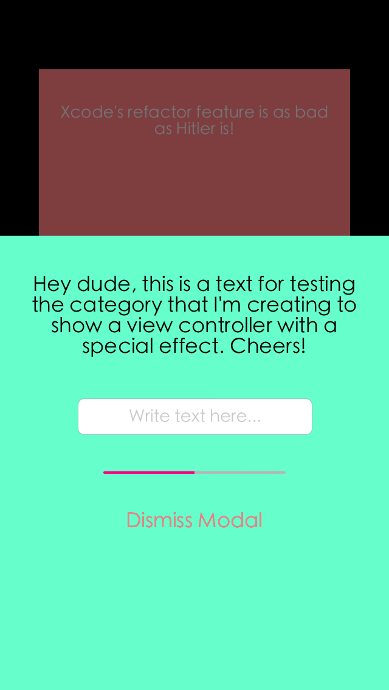

Overview
==============
[](https://github.com/ThXou/LCModal)
[](https://github.com/ThXou/LCModal)
[](https://www.apache.org/licenses/LICENSE-2.0.html)



An Objective-C category to present a semi modal view controller with a nice push back effect for the presenting view controller.

It's a minimalist version of the [KNSemiModal](https://github.com/kentnguyen/KNSemiModalViewController) by kentnguyen.

Installation
==============

Add this line to your podfile:

```ruby
pod 'LCModal', '~> 1.0'
```

Or manually add the source folder to your project.

Usage
==============

This category only have two methods. One of them for presenting the view controller and the other for dismissing:

```objective-c
- (void)lc_presentViewController:(UIViewController *)viewControllerToPresent completion:(void (^)(void))completion;
- (void)lc_dismissViewControllerWithCompletion:(void (^)(void))completion;
```

Instantiate the view controller like you normally would do. Here is an example that comes form the source code:

```objective-c
- (IBAction)showModal:(id)sender
{
    NewViewController *controller = [self.storyboard instantiateViewControllerWithIdentifier:@"NewViewController"];
    controller.view.frame = CGRectMake(0.0, 0.0, 320, 374);
    controller.delegate = self;
    [self lc_presentViewController:controller completion:nil];
}
```

The project comes with an example of usage and a way to use it with protocols too.

License
==============

The MIT License (MIT)
 
Copyright (c) 2013 Luis Cardenas. All rights reserved.
 
Permission is hereby granted, free of charge, to any person obtaining a copy
of this software and associated documentation files (the "Software"), to deal
in the Software without restriction, including without limitation the rights
to use, copy, modify, merge, publish, distribute, sublicense, and/or sell
copies of the Software, and to permit persons to whom the Software is
furnished to do so, subject to the following conditions:
 
The above copyright notice and this permission notice shall be included in
all copies or substantial portions of the Software.
 
THE SOFTWARE IS PROVIDED "AS IS", WITHOUT WARRANTY OF ANY KIND, EXPRESS OR
IMPLIED, INCLUDING BUT NOT LIMITED TO THE WARRANTIES OF MERCHANTABILITY,
FITNESS FOR A PARTICULAR PURPOSE AND NONINFRINGEMENT. IN NO EVENT SHALL THE
AUTHORS OR COPYRIGHT HOLDERS BE LIABLE FOR ANY CLAIM, DAMAGES OR OTHER
LIABILITY, WHETHER IN AN ACTION OF CONTRACT, TORT OR OTHERWISE, ARISING FROM,
OUT OF OR IN CONNECTION WITH THE SOFTWARE OR THE USE OR OTHER DEALINGS IN
THE SOFTWARE.
